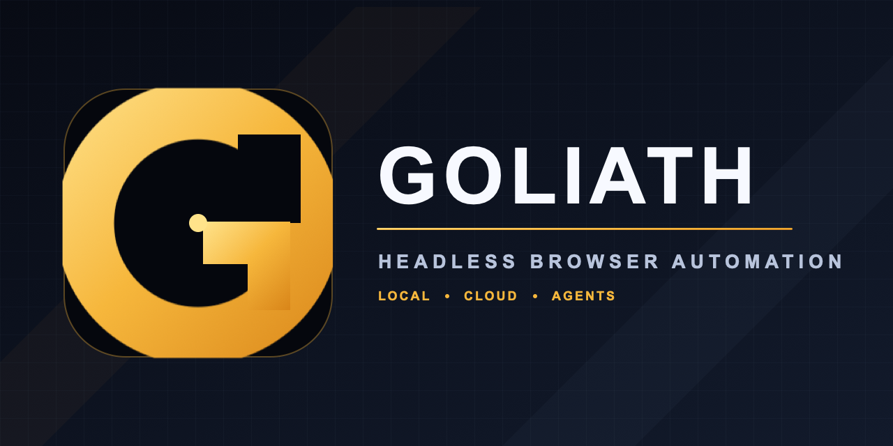

# Goliath



**Hermes-native browser hands for AI agents.**

Goliath gives AI agents a real browser when their normal tools hit a wall. A harness keeps reasoning; Goliath supplies persistent Firefox-based browser sessions with configurable anti-detection measures and the human interactions needed to finish the job: sign documents, complete forms, upload files, work through courses, handle complex controls, and continue across authenticated sessions.

Those measures can reduce ordinary automation fingerprints, but they do not guarantee that a site, CAPTCHA, or bot-detection system will accept a session.

Goliath is built first for Hermes: it prints ready-to-paste `config.yaml`, keeps a stable browser identity for each Hermes agent, and starts and stops with the harness over stdio. It also speaks standard MCP for Claude, Codex, Cursor, and other agent harnesses, with REST/OpenAPI available when needed. “Hermes-native” means first-class configuration and lifecycle integration; Goliath remains an independent project and a portable MCP server.

## Quickstart

Requirement: Node.js 22+. The one-time setup downloads about 300 MB for the browser engine.

```bash
npm install @mechanica-labs/goliath
npx camoufox-js fetch
npx goliath setup
npx goliath doctor
```

If you already have a compatible Camoufox executable, set `GOLIATH_EXECUTABLE=/absolute/path/to/camoufox` instead of running `npx camoufox-js fetch`.

`goliath setup` creates the private local data directories and prints ready-to-paste Hermes YAML plus JSON for other MCP clients. The generated Hermes command is pinned and self-contained:

```yaml
mcp_servers:
  goliath:
    command: "npx"
    args: ["-y", "@mechanica-labs/goliath@0.1.0", "mcp"]
    env:
      GOLIATH_USER_ID: "personal-assistant"
```

Restart Hermes after adding the configuration. The MCP process checks for an existing local server and starts one when needed, then shuts down the server it owns when Hermes disconnects. There is no daemon to install or manage. Keep `GOLIATH_USER_ID` stable for each agent so its authenticated browser profile persists across tasks.

See the [Hermes-native harness setup guide](https://github.com/Mechanica-Labs/goliath/blob/main/docs/HARNESS_SETUP.md) for the full Hermes workflow, JSON-based MCP clients, remote-server configuration, uploads, and troubleshooting.

## REST quick start

For direct API use, run `npx goliath serve` after the npm Quickstart. The server listens on `http://127.0.0.1:9377` by default; API docs are at `/docs`.

```bash
curl -X POST http://127.0.0.1:9377/tabs \
  -H 'Content-Type: application/json' \
  -d '{"userId":"agent-1","sessionKey":"task-1","url":"https://example.com"}'
```

`goliath serve` installs a missing browser engine automatically; `npx camoufox-js fetch` is the explicit equivalent. Snapshot refs reset when a page navigates or materially changes, so request a fresh snapshot before retrying a stale ref.

## Server lifecycle

Goliath can run in the foreground for a harness or supervisor, or manage a background process that is health-checked before the command returns:

```bash
npx goliath serve    # foreground
npx goliath up       # background
npx goliath status
npx goliath logs     # add -f to follow
npx goliath restart
npx goliath down
```

Background state is stored in `.goliath/` beside the installed package or checkout. A failed startup is stopped automatically and reports the tail of its log.

## Agent capabilities

- Observe: accessibility snapshots, versioned semantic state, screenshots, links, images, structured extraction, downloads, and tab statistics.
- Act: click, type, press keys, hover, scroll, wait, select options, drag and drop, navigate, resize the viewport, and attach files.
- Remember: isolate state by `userId`, group tabs by `sessionKey`, restore browser profiles, and fork explicit storage checkpoints.
- Hand off: enable the optional noVNC plugin when a human must complete MFA, OAuth consent, CAPTCHA, or another visual step.
- Integrate: use standard MCP, the REST API, or the generated OpenAPI document.

API documentation is available at `/docs`; the machine-readable contract is served at `/openapi.json` and committed as `openapi.json`.

## Secure file uploads

Agents may only attach regular files that resolve inside `GOLIATH_UPLOADS_DIR`, which defaults to `~/.goliath/uploads`. Absolute paths are required. Directory traversal and symlinks escaping the configured root are rejected.

```bash
mkdir -p ~/.goliath/uploads
cp ./invoice.pdf ~/.goliath/uploads/

curl -X POST 'http://127.0.0.1:9377/tabs/TAB_ID/upload' \
  -H 'Content-Type: application/json' \
  -d '{"userId":"agent-1","path":"/absolute/path/to/.goliath/uploads/invoice.pdf"}'
```

If the page does not already contain an `input[type=file]`, include the ref or selector of the button that opens its file chooser.

## Network security

Goliath binds to `127.0.0.1` by default. Binding beyond loopback requires `GOLIATH_ACCESS_KEY`; send it as `Authorization: Bearer <key>` on every request except `/health`. Put TLS in front of the service when traffic leaves the machine.

```bash
GOLIATH_BIND_HOST=0.0.0.0 \
GOLIATH_ACCESS_KEY='replace-with-a-long-random-secret' \
npm start
```

The Docker image binds to `0.0.0.0`, so remote API calls require a key:

```bash
docker build -t goliath .
docker run --rm -p 9377:9377 \
  -e GOLIATH_ACCESS_KEY='replace-with-a-long-random-secret' \
  goliath
```

The normal interaction loop is: create a tab, navigate, request a snapshot, act using element references such as `e1`, then request a fresh snapshot after navigation.

## Semantic state and safe actions

`POST /tabs/:tabId/observe` adds a durable, versioned layer above temporary `eN` refs. It returns best-effort semantic node IDs, changes from the prior observation, readiness confidence and reasons, affordances, provenance, capability limits, and prompt-injection signals. Page content is always labeled untrusted.

```bash
# Observe. Save snapshotId and the desired node ID from this response.
curl -sS -X POST http://127.0.0.1:9377/tabs/TAB_ID/observe \
  -H 'Content-Type: application/json' \
  -d '{"userId":"agent1","goalSelector":"main"}'

# Plan against that exact state, then execute the returned contract.
curl -sS -X POST http://127.0.0.1:9377/tabs/TAB_ID/actions/plan \
  -H 'Content-Type: application/json' \
  -d '{"userId":"agent1","snapshotId":"SNAPSHOT_ID","action":{"kind":"click","nodeId":"NODE_ID"},"policy":{"allowedOrigins":["https://example.com"]}}'

curl -sS -X POST http://127.0.0.1:9377/tabs/TAB_ID/actions/execute \
  -H 'Content-Type: application/json' \
  -d '{"userId":"agent1","contractId":"CONTRACT_ID","confirm":true,"postconditions":[{"kind":"url_matches","pattern":"/next$"}]}'
```

Successful legacy mutations invalidate outstanding semantic contracts. Use `GET /tabs/:tabId/events?userId=agent1` for observation events and `GET /tabs/:tabId/workflow?userId=agent1` for successful semantic steps as a replayable role/name workflow.

Semantic extraction binds JSON Schema properties to `x-node-id` values and returns per-field evidence, confidence, and unresolved fields. `deterministic_then_model` currently reports unresolved fields with `modelUsage: null`; it never silently sends page content to a model.

### Secrets, checkpoints, forks, and human handoff

Register credentials through the authenticated REST API or another trusted channel, not an agent prompt. Values are held in memory, never echoed, and `type_secret` contracts can use them only on exact allowed origins.

```bash
curl -sS -X POST http://127.0.0.1:9377/sessions/agent1/checkpoints \
  -H 'Content-Type: application/json' -d '{"checkpointId":"before_checkout"}'

curl -sS -X POST http://127.0.0.1:9377/sessions/agent1/forks \
  -H 'Content-Type: application/json' \
  -d '{"checkpointId":"before_checkout","newUserId":"agent1-branch","url":"https://example.com/cart"}'

curl -sS -X POST http://127.0.0.1:9377/tabs/TAB_ID/handoff \
  -H 'Content-Type: application/json' \
  -d '{"userId":"agent1","action":"request","reason":"complete MFA"}'
```

Checkpoints contain cookies, local storage, and IndexedDB and default to `~/.goliath/checkpoints/` (`GOLIATH_CHECKPOINTS_DIR` overrides it). They do not clone live DOM, the JavaScript heap, open connections, or remote server state. Forks create isolated contexts from that state, with the explicit checkpoint taking precedence over any old persistence profile for the destination user. Human handoff pauses mutating tab routes and prevents both individual-tab and tab-group deletion until the handoff is resumed or cancelled.

Semantic safety is fail-closed at the browser boundary: contracts are tied to one snapshot, domain policies run before execution, page instructions remain untrusted, and registered values are redacted from accessibility and semantic snapshots. Screenshot and arbitrary-evaluation endpoints remain privileged and can observe rendered data, so do not expose them to untrusted callers.

## Humanized input and telemetry

Click, type, and scroll requests accept `"humanized": true`. The API then uses curved pointer trajectories, bounded jitter and hesitation, variable key timing, or eased wheel pulses instead of a single instant automation event. An object form can select the `fast`, `balanced`, or `deliberate` profile.

```bash
curl -sS -X POST http://localhost:9377/tabs/TAB_ID/click \
  -H 'Content-Type: application/json' \
  -d '{"userId":"agent1","ref":"e1","humanized":{"profile":"balanced"}}'

curl -sS 'http://localhost:9377/tabs/TAB_ID/behavior?userId=agent1'
```

Behavior reports retain at most 512 in-memory events and summarize timing entropy and variance. Their `assessment` is a local diversity heuristic, not proof that a third-party CAPTCHA or bot detector will accept a session.

Sensitive cookie and trace endpoints can additionally use `GOLIATH_API_KEY`; administrative shutdown can use `GOLIATH_ADMIN_KEY`.

Crash and hang reporting is disabled by default and has no built-in destination. To opt in, set both `GOLIATH_CRASH_REPORT_ENABLED=true` and `GOLIATH_CRASH_REPORT_URL` to a trusted HTTPS relay. Goliath sends no telemetry when either setting is absent or the URL is not HTTPS.

## Browser runtime

The product and API are named Goliath; the browser runtime is provided by the public `camoufox-js` package. Goliath stages a complete download before replacing an existing runtime, so an interrupted download leaves the previous working installation intact. Run `goliath doctor` to inspect the installation, or supply an existing compatible executable with `GOLIATH_EXECUTABLE`. `CAMOUFOX_EXECUTABLE`, `CAMOUFOX_EXECUTABLE_PATH`, and `CAMOFOX_EXECUTABLE_PATH` remain compatibility aliases.

Terminal output is animated and colorized when interactive, and switches to plain single-line output when piped or running in CI. Set `NO_COLOR=1` to disable color or `GOLIATH_ASCII=1` to replace box-drawing characters.

## Hands: multi-step form automation

The `POST /tabs/:tabId/hands` route runs an ordered list of UI actions—click,
type, select, check, wait, scroll, press, and submit—against one tab in a single
request. It stops at the first failing step and reports its index, so a form
that used to take six round-trips is one call:

```bash
curl -sS -X POST http://localhost:9377/tabs/TAB_ID/hands \
  -H 'Content-Type: application/json' \
  -d '{"userId":"agent1","steps":[{"action":"type","ref":"e1","text":"Carlos"},{"action":"click","ref":"e2"}]}'
```

MCP clients use the same capability through the `goliath_hands` tool. Full
action reference and constraints are in [AGENTS.md](AGENTS.md#hands-multi-step-workflow).

## MCP and plugins

Bundled plugins provide YouTube transcript extraction, persistent session storage, and optional VNC access. Enable or configure them in `goliath.config.json`.

```bash
npm run plugin list
npm run plugin install https://github.com/example/goliath-plugin
```

## Development

```bash
GOLIATH_SKIP_DOWNLOAD=1 npm install
npm run build
npm run generate-openapi
npm test
npm run benchmark:behavior
```

After changing a REST route, update its `@openapi` block and regenerate `openapi.json`. See [AGENTS.md](AGENTS.md) for the route and plugin contribution rules.

The behavior benchmark runs 26 local synthetic gates across semantic, spatial, timing, grid, multi-step, unfamiliar-schema, typing, and scrolling cases. It uses deterministic gate solvers to measure the interaction layer, so its pass rate does not measure autonomous reasoning or real CAPTCHA acceptance. TLS/JA3 and IP reputation also require separate external validation.

## Licensing

Goliath's original source is MIT licensed. Camoufox and `camoufox-js` are MPL-2.0 licensed; other dependencies retain their respective licenses. See [NOTICE.md](NOTICE.md).
